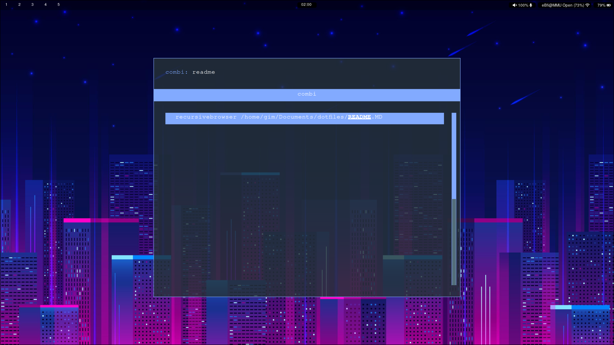
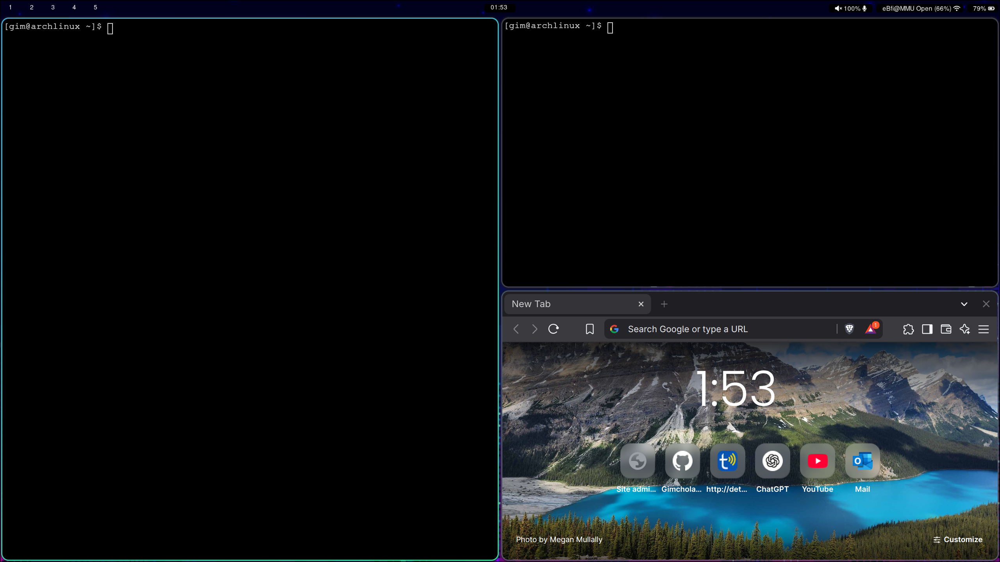
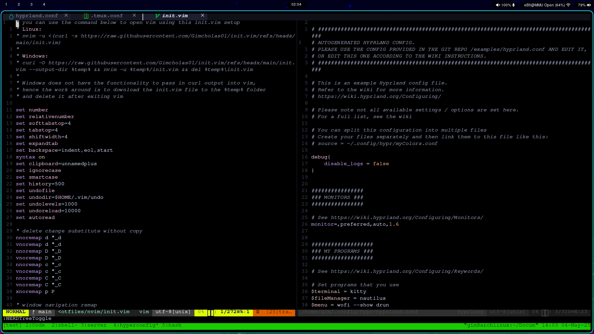

# My Workflow
:computer: Arch / Ubuntu -> :white_square_button: Hyprland -> :eyeglasses: tmux -> :pencil: nvim 
---

# Config files
[Hyprland](https://github.com/Gimcholas01/dotfiles/tree/main/hypr) (window manager), [rofi](https://github.com/Gimcholas01/dotfiles/tree/main/rofi) (app launcher), [waybar](https://github.com/Gimcholas01/dotfiles/tree/main/waybar) (status bar)
[tmux](https://github.com/Gimcholas01/dotfiles/blob/main/.tmux.conf)
[nvim](https://github.com/Gimcholas01/dotfiles/tree/main/nvim)
---

# Samples
## Hyprland

## tmux + nvim

